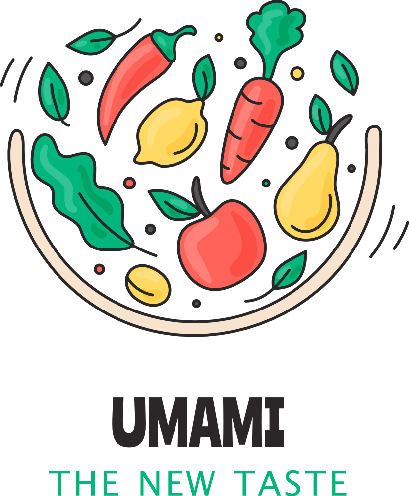
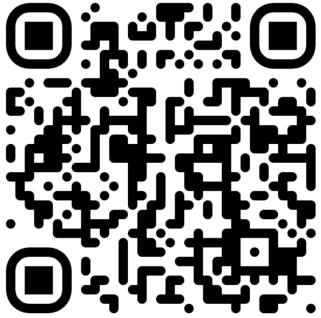

# Umami - ML/DNN assisted food image recognition

This is a boot camp graduation project. The aim - to develop and implement an ML-assisted food recognition service, that would allow people to recognize unfamiliar/unusual cuisine dishes - what it is, does it contain harmful / unpleasant ingredients, etc. 

More information (authors, tech stack, algorithm and data details, results) you can find in the presentation  **[Umami.pptx](Umami.pptx) / [Umami.pdf](Umami.pdf)** file or take a look at the running service [here](https://goracij.duckdns.org:8501/). It should be mentioned though, that service is running on a local, low-power machine via free DDNS service and DS-Lite provider. Hence, some disturbances in operation are inevitable.
